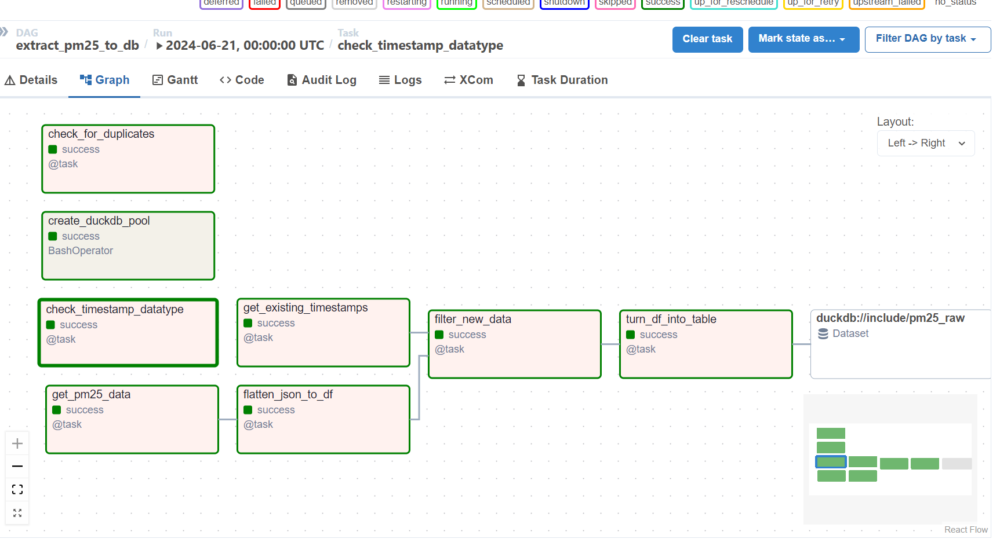

# PM2.5 Monitoring Program

In this program, a final report shows 
- a list of times when the level is above the danger threshold of 30 (I used 22 here as an example)
- the daily maximum, daily minimum, and daily average pollution value

## Table of Contents
- [Abstract](#abstract)
- [Highlights of this project](#highlights-of-this-project)
- [Project Structure](project-structure)
- [How to run it](#how-to-run-it)
- [Overview of the pipeline](#overview-of-the-pipeline)

## **Abstract**

### Data Source: [PM25 Open Data API](https://app.swaggerhub.com/apis-docs/I2875/PM25_Open_Data/1.0.0#/Device/get_Device_Latest)
### Project: airbox 

### The workflow is
1. **Data Acquisition**: read the data for a device using the /device/<device_id>/history/ endpoint
2. **Data Backup**: save the raw data into DuckDB with the appropriate schema
3. **Data Transformation**: 
- Keep the report-needed columns
- Generate the list of times when PM2.5 is over 30 (I used 22 as an example here, otherwise no values show)
- Calculate the daily maximum, daily minimum, and daily average pollution value
4. **Data Validation**: 
- datatype is correct
- no duplicate records
5. **Data Reporting**: Streamlit visualises the report-ready data and delivers insights

### Infrastructure
Used Techniques are:
- Data Orchestration + Containerization: Astro CLI (Apache Airflow + Docker Compose)
- Get data from API: Python
- Data storage and transformation: DuckDB
- Data visualisation: Streamlit

## Highlights of this project
1. Airflow **orchestrates** the pipeline, benefits include **visulise** the whole process, store historical **logs**, **scale** the workload, **schedule** running time (i.e., daily), etc
2. Airflow **stages** data processing, from data extraction, data transformation to data reporting, splits the whole into small controllable micro-pieces
3. DuckDB stores data and performs transformation, and Airflow adds test tasks to control data quality
4. Docker Compose **containerises** the running environment (i.e., dependencies)

## Project Structure
```graphql
├── README.md #this file
├── abseil-cpp #library to support airflow-provider-duckdb package
├── airflow
│   ├── Dockerfile
│   ├── README.md
│   ├── dags #all pipelines are defined in this folder
│   │   ├── __pycache__
│   │   ├── extract_pm25_to_db.py #step1
│   │   ├── reporting_table.py #step2
│   │   └── stream_run.py #step3
│   ├── include #all artifacts including database, global environment, local functions, streamlit app
│   │   ├── __pycache__
│   │   ├── api_request.py
│   │   ├── global_variables
│   │   ├── monitor_database.py
│   │   ├── pm25_ducks.db
│   │   ├── streamlit_app.py
│   │   └── test.py
│   ├── packages.txt
│   ├── plugins
│   ├── pm25_ducks.db
│   ├── requirements.txt #list all dependencies
│   └── tests
│       └── dags
└── src
    ├── dag1.png
    ├── dag2.png
    ├── dependency.png
    ├── fork_and_codespaces.png
    └── reports.png
```

## How to run it
### Option 0 Codespaces (Strongly Recommend! Do not need local environment)
- Step 0 Fork this repository into your own GitHub
- Step 1 Create codespaces with 4-code Machine Type, choose it from New with options (otherwise docker is slow)

- Step 2 Create a Python virtual environment and activate it
```bash
cd airflow/
python3 -m venv .venv
source .venv/bin/activate
```
- Step 3 Install **Astro Cli**
```bash
curl -sSL install.astronomer.io | sudo bash -s
```
- Step 4 **Step 3 Start the containers to run Airflow**
```bash
astro dev start
```
- Go to port 8080 to check the data pipeline in the UI
URL: http://localhost:8080

### Option 1 Ubuntu 20.04 (Linux environment)
#### Getting Start
- Step 0 Clone this repository:
   ```bash
   git clone https://github.com/xiangivyli/pm25_monitoring.git
   cd pm25_monitoring
   ```

- **Step 1 Create a Python virtual environment and activate it**
```bash
cd airflow/
# Setup Python, install python3-venv package
sudo apt-get update
sudo apt-get install python3-venv
# Create the virtual environment and activate it
python3 -m venv .venv
source .venv/bin/activate
```
- Step 2 Install **Astro Cli**
```bash
curl -sSL install.astronomer.io | sudo bash -s
```

- **Step 3 Start the containers to run Airflow**
```bash
astro dev start
```

- Go to port 8080 to check the data pipeline in the UI
URL: http://localhost:8080

### Option 2 Local Run, Git Bash (Windows environment)
#### Prerequisites
1. Docker (Link: https://docs.docker.com/get-docker/)
2. Python 3.8 or later
3. `pip` and `virtualenv` for Python
4. Clone this repository:
   ```bash
   git clone https://github.com/xiangivyli/pm25_monitoring.git
   cd pm25_monitoring
   ```

#### Getting Start, instructions use Git Bash to run these commands
1. Setup Python virtual environment
```bash
python -m venv .venv
source .venv/Scripts/activate
```
2. Install Astro Cli
```bash
cd airflow
winget install -e --id Astronomer.Astro
```
3. Run `astro dev start` in the airflow folder
4. After your Astro project has started. View the Airflow UI at `localhost:8080`.
5. View the streamlit app at `localhost:8501`.

  
## Overview of this project
There are 3 `dag`s in the whole process, connected by datasets
<div align="center">
  
</div>

**DAG 1** extract_pm25_to_db, get JSON data from API, convert it to dataframe and insert into DuckDB, 

Key points:
1. **schedule: daily, run once at midnight** 
2. **Filter out existing records when update, set (device_id, timestamp) is UNIQUE to avoid duplicates**
3. **Monitor data quality without duplicate records and correct timestamp datatype**



 **DAG 2** reporting_table, generate the daily maximum, minimum, and average values, and detect the data beyond 30 (I used 22 here as an example),

Key points:
1. **schedule: triggered by dag 1, as long as dag 1 runs, dag 2 runs once**
2. **Every run will generate a brand-new time list and a daily value table**
3. **Transformation run in a pool to prevent parallel requests to duckdb** 


 **DAG 3** run_streamlit, dashboarding, visualise data
        
Key points:
1. **schedule: triggered by dag 2, as long as dag 2 runs, update the report once**
2. **data source is pm25_ducks.db, streamlit_app.py design the report**


## Next step
Deploy the program in the Cloud VM

## Thanks for taking the time to check my project, any suggestions or questions are welcomed :)


